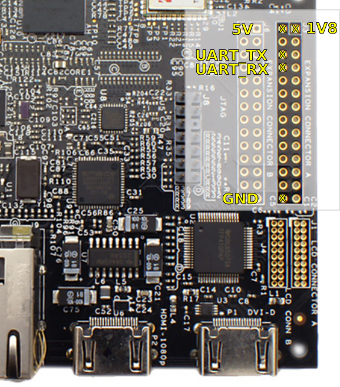
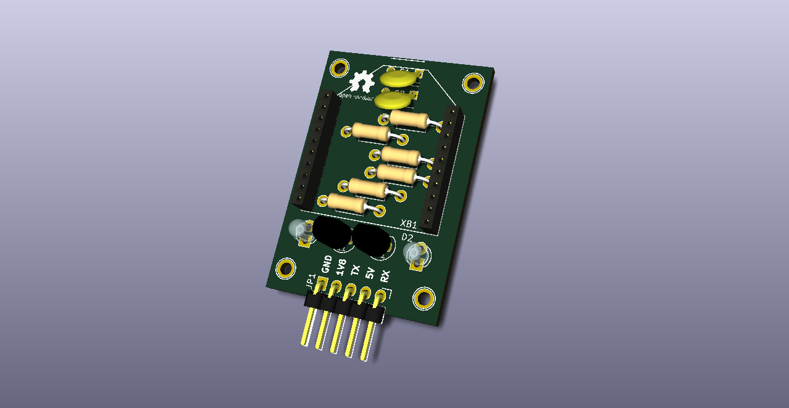

XBee adapter for PandaBoard designed in KiCad
=============================================

Description
-----------

  An XBee module can be connected to a PandaBoard through a serial connection
using UART pins of one of expansion connector of the board. However, XBee
modules are powered with 3.3v and board pins works with 1.8v.

Based on a initial SMD design [wifly-adapter-board][1] from Dirk
Grappendorf, this adapter also solve this converting signals to right levels.

In addition, this design only has one copper layer for easy exposure of PCB,
uses non-smd components and adds routes for two (optional) status LEDs.

[1]: https://github.com/grappendorf/caretaker-devices/

Connection to PandaBoard
------------------------

| XBee Adapter | Expansion Connector "A" (JP3) |
|--------------|-------------------------------|
|  Pin 1 (GND) |  Pin 27 or Pin 28 (GND)       |
|  Pin 2 (1V8) |  Pin 1 (1V8 I/O Power)        |
|  Pin 3  (TX) |  Pin 6 (UART4 Trasmit Data)   |
|  Pin 4  (5V) |  Pin 2 (5Vdc Input Power)     |
|  Pin 5  (RX) |  Pin 8 (UART4 Receive Data <F11>   |

------------------------------------------------------------------------------
**WARNING!**

Be careful connecting 1V8 pin. Any overvoltage leave the board unusable.

------------------------------------------------------------------------------



**More info** at [PandaBoard-ES Reference Manual][2], page 43.

[2]: http://pandaboard.org/sites/default/files/board_reference/pandaboard-es-b/panda-es-b-manual.pdf

Photos
------

**Schema**


**PCB**


**3D preview**

- [With XBee module](xbee-pandaboard-adapter-3d.xbee.png)
- [Reverse view](xbee-pandaboard-adapter-3d.back.png)

KiCad Hacks in this design
--------------------------
  If you want to see the XBee module model in 3D preview, replace *zeros* by
*ones* in line 37014 of *xbee-pandaboard-adapter.kicad_pcb*.

    $ sed '37014s/0/1/g' -i xbee-pandaboard-adapter.kicad_pcb

Changes:
```
--- a/xbee-pandaboard-adapter.kicad_pcb
+++ b/xbee-pandaboard-adapter.kicad_pcb
@@ -37011,7 +37011,7 @@
       (net 13 "Net-(XB1-Pad20)"))
     (model ${KIPRJMOD}/XBee.wrl
       (at (xyz 0.04 0 0.05))
-      (scale (xyz 0 0 0))
+      (scale (xyz 1 1 1))
       (rotate (xyz 270 0 0))
     )
     (model Socket_Strips.3dshapes/Socket_Strip_Straight_1x10.wrl
```

LICENSE
--------
- [CERN Open Hardware License v1.1](LICENSE.txt)

References
----------
- [PandaBoard-ES Reference Manual][2]
- [wifly-adapter-board][1] by Dirk Grappendorf
- [XBee 3D model (XBee.wrl)][3] by Yvon Tollens from kicadlib.org
- [Open Source Hardware Logo][4] by Wayne and Layne, LLC.

[3]: http://www.kicadlib.org/modules/xbee.zip
[4]: https://github.com/wayneandlayne/Open-Source-Hardware-Logos-for-Kicad
